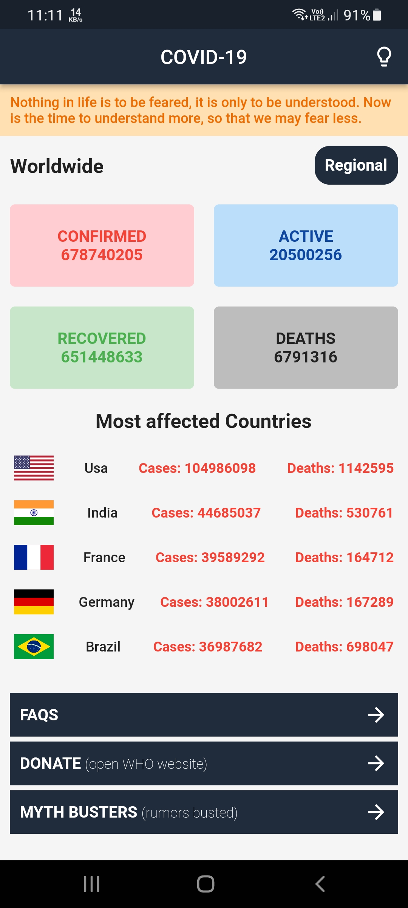
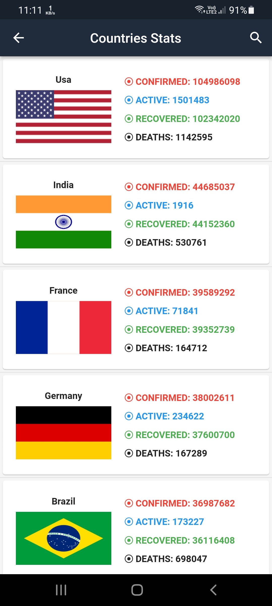
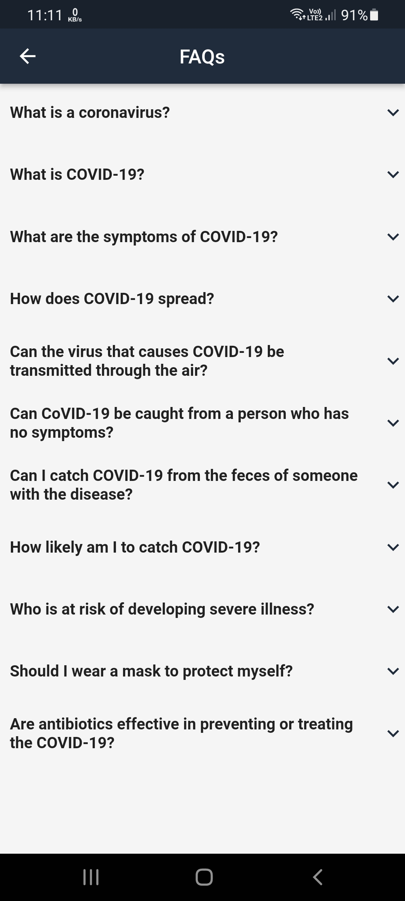
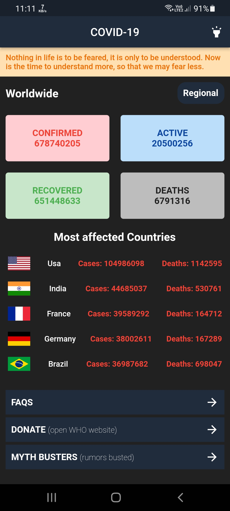
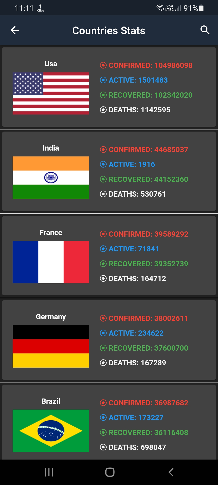
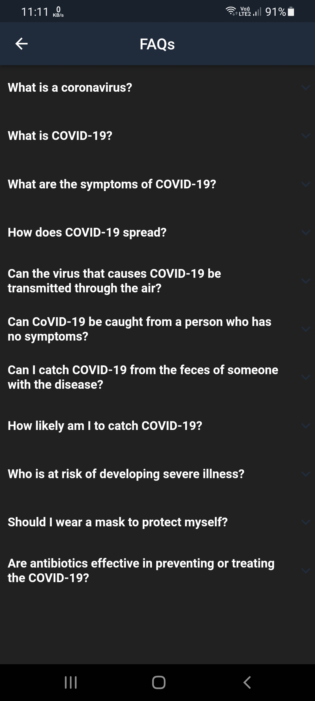

# nCovid-19

A simple app used to track the coronavirus, which includes information on confirmed cases as well as deaths. 
Depending on Provider as State Management.

<div align="center">

[](#)
[](https://github.com/a7madZ3Dev/nCovid-19/fork)
[](https://github.com/a7madZ3Dev/nCovid-19/issues)
[](#)

</div>

## 💻 Installation steps

- Updated to `Flutter 2.10.3` Now!
- Dart SDK `2.18` with Sound Null Safety!

Open CMD where you want to clone the project & run the following commands

```
git clone https://github.com/a7madZ3Dev/nCovid-19.git
cd nCovid-19
flutter packages get
flutter run
```
<br>

## 📱 Screen Shots 
### 🌞 Light Mode Theme

  

### 🌜 Dark Mode Theme

  

## 🎥 Promo Video

  

## 🔗 API Information

API Used: https://disease.sh/

## 🎯 Features

✅ Offline Mode

✅ Search about Country 

✅ Dark Mode
<br>

## 🔑 License
- This project is licensed under the MIT License - see the [LICENSE](LICENSE.md) file for details

## 🧑 Author

#### Ahmad Alzoabi
[](https://www.linkedin.com/in/ahmad-alzoabi-0623a8233/)

You can also follow my GitHub Profile to stay updated about my latest projects:

[](https://github.com/a7madZ3Dev)

If you liked the repo then kindly support it by giving it a star ⭐!

Copyright (c) 2023 Ahmad Alzoabi

